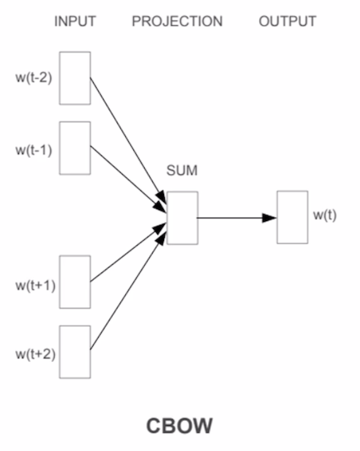
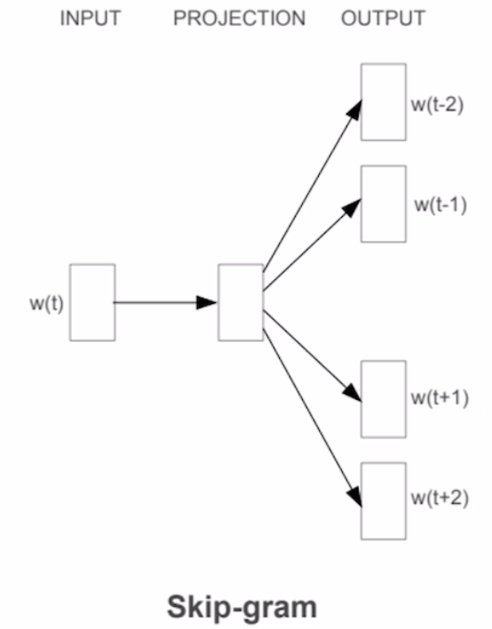
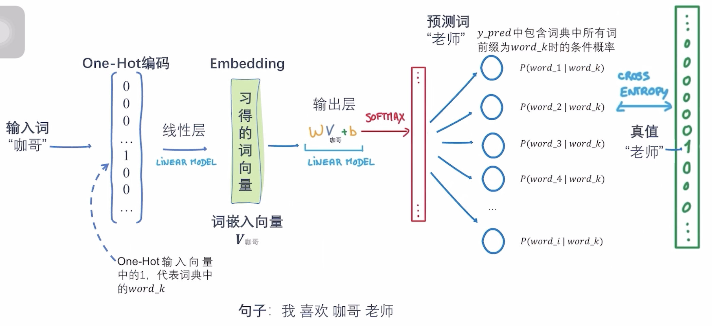

# Use Vector to Represent a Word
Before a language model can handle the words, we must generate a vec representation for each word.
+ One-Hot: Use a vector $v(w) \in R^m$ to represent a word, **m is the length of dictionary**, only one elem in $v(w)$ is 1, others are 0.
+ Distributed Representations: Word2Vec, GloVe, FastText.

# What is Word2Vec?
Word2Vec is also a neural network(But shallow), it use an algorithm(CBOW or Skip-Gram) to learn a vec representation for each word. Word2Vec based on an assertion

# CBOW
Continious Bag of Words, use the context to predict the central word.   
A neural network whose inputs are the context words, the target is the central word. A sliding window from the starting word to the end.

# Skip-Gram
Use the central word to predict the context words.

# The General Process of Word2Vec
1. One-hot encoding: Each word(token) $w$ is encoded to a vector $v(w) \in R^k$, $k$ is the length of dictionary.
2. The one-hot vector goes through an FC model to embed the k-dim one-hot vector to m-dim, $m < k$.
3. Use the embedding vector as the input for CBOW or Skip-Gram.
4. Back-prop to train the neural network.

**NOTICE**: The purpose of this FC model is NOT to predict a pricise output for the context words(for skip-gram) or central word(for CBOW), the target of word2vec neural network is to get a fine-embedded vector(green one in the image), then gives this embedding vector to other language models.
