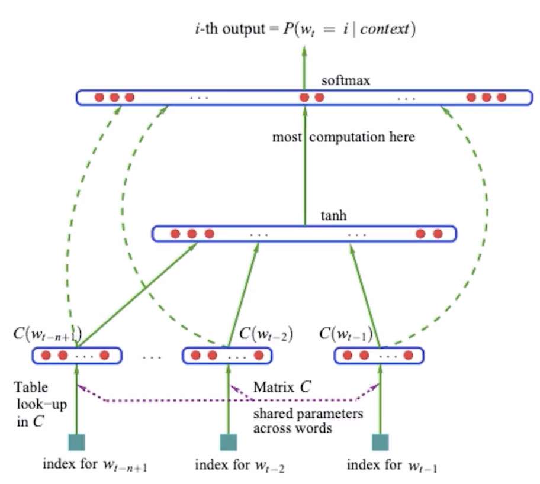

# NLPM
Neural Probabilistic Language Model. A general name for modern language model, like BERT and GPT, they all follow this architecture, only differ in implementation details.
1. Embedding Layer: Embed a word into a vector space(Same function as Word2Vec). The input of this layer is the word_index, **not a one-hot vector**. 
IMPLEMENTATION: nn.Embedding(vocab_size, embed_size)
2. Hidden Layer: Learn the complex sementic info between words.
3. Output layer: Output the probability of next word using Softmax.  
