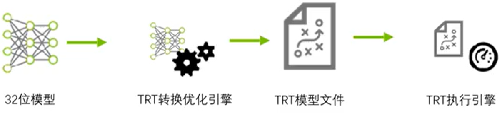
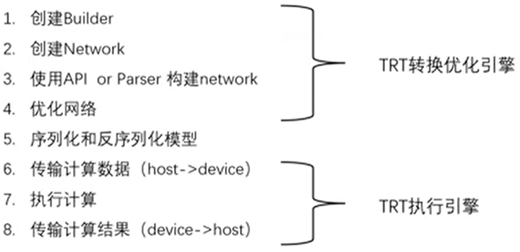

# Basic Workflow for TensorRT

1. An FP model trained with PyTorch/TensorFlow/..
2. TRT Transfer Optimize Engine: Transfer the model, optimize kernels, fuse operators, quantizations, generate the TRT model file.
3. TRT model file(plan file): Not compatible between different Nvidia GPU architecture(Pascal, Ampere...)
4. TRT Running Engine: Memory optimizations, multi-thread...

# TensorRT Optimization Strategies
1. Low precision optim: INT8, FP16
2. Kernel optim: cuBLAS gemm
3. Operators fusing

# Components of TensorRT
1. Close-source libs: Official libs
2. GitHub open-source components: parsers(caffe, onnx), samples, plugin

# TensorRT Usage Workflow

1. Create builder: 
   ```cpp
   auto builder = createInferBuilder(Logger);
   ```
2. Create network:
   ```cpp
   // Create an empty network
   auto network = builder -> createNetwork();
   auto config = builder -> createBuilderConfig();
   ```
3. Construct network, set config:
   ```cpp
   """
   API: It's complicated
   """
   // Add a conv layer with 20 outputs and a 5x5 filter
   ConvolutionLayer* conv1 = network -> addConvolution(
      *scale_1 -> getOutput(0), 
      20, DimsHW{5, 5}, 
      mWeightMap["conv1filter"], 
      mWeightMap["conv1bias"]
   );
   assert(conv1);

   """
   Parser: 
   Use a caffe parser to parse the caffe model to TRT network
   """
   mEngine = nullptr;
   const nvcaffeparser1::OBlobNameToTensor* blobNameToTensor = parser -> parse(
      locateFile(mParams.prototxtFileName, mParams.dataDirs).c_str(),
      locateFile(...).c_str(),
      *network, dataType == DataType::kINT8 ? DataType::kFloat : dataType
   );

   """
   Set config
   """
   builder -> setMaxBatchSize(mParams.batchSize);
   config -> setMaxWorkspaceSize(16_MiB);
   ...
   ```
4. Optimize network:
   ```cpp
   """
   Build engine with config: This step could be time-consuming.
   Engine is a model, to be executed, we need to create a context from the engine.
   Params and buffers are stored in engine, so there can be only one engine. 
   Middle result is stored in context, so there can be more than one context for each engine.
   """
   auto engine = buildEngineWithConfig(*network, *config)
   auto context = engine -> createExecutionContext();
   bool status = context -> execute(batchSize, buffers);
   ```
5. Serialize and deserialize model:  
   Step 1-4 outputs a TRT engine(model), serialize the engine(Save to file), TRT Running Engine will load the engine from file(deserialize) when infering.
   ```cpp
   // Serialize engine to file
   auto memory = engine -> serialize()
   saveFile(memory)

   // Load engine from file
   auto engine = deserializeCudaEngine(blob, size)
   ```
6. Transfer data: Host to device
7. Computations
8. Transfer result: Device to host